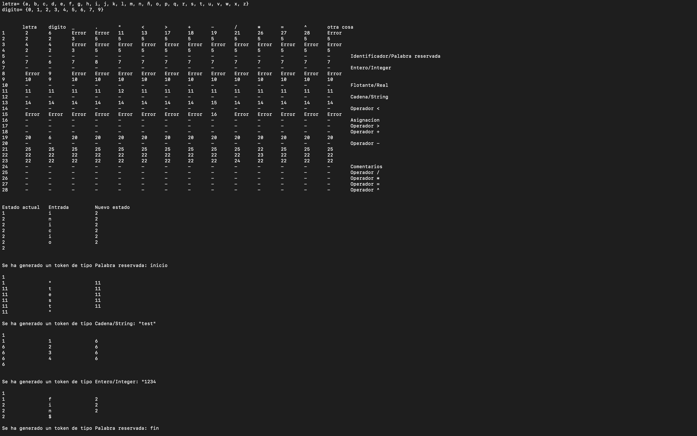

# Analizador Léxico #

## Notas: ##

* Para ejecutar el programa es necesario contar con el Java Development Kit (JDK)
* En una terminal entrar a la carpeta con los archivos Java y usar el comando: `java AnalizadorL` 
* Se incluye una captura de pantalla del resultado

